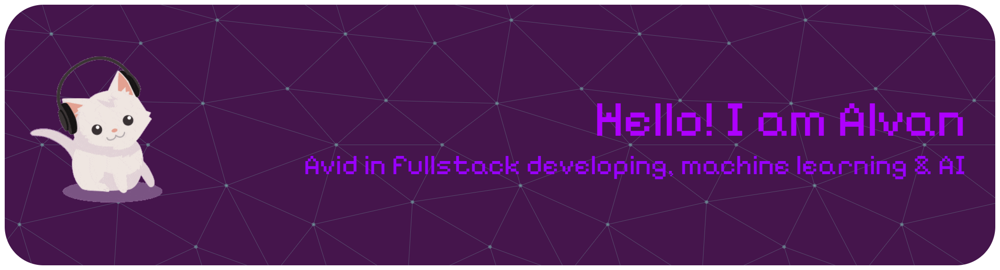

  

# Hi there, I'm Alvan 👋

### 🚀 Introduction
I am a motivated student who is currently studying in Year 2 Diploma in Information Technology in Tunku Abdul Rahman University of Technology and Management (TARUMT)
I am extremely passionate about tackling complex challenges with unconventional, high-impact solutions

---

### 🛠 My Tech Stack

**Languages & Logic**

**Frontend & Mobile**

**Backend & Frameworks**

**Database & Tools**

---

### 📊 GitHub Stats

---

### 🌐 Connect with Me

